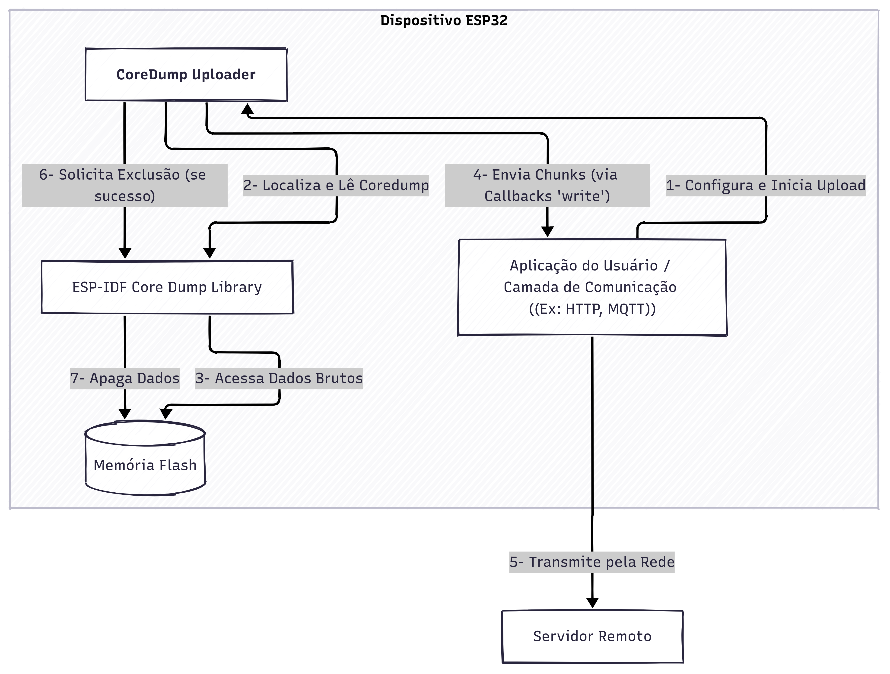
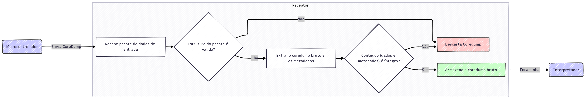
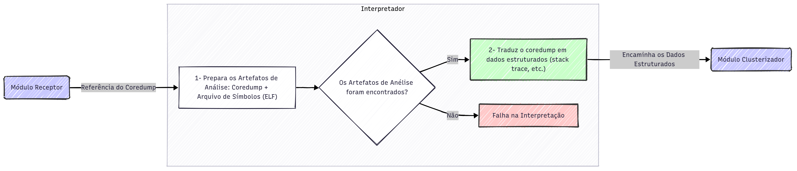
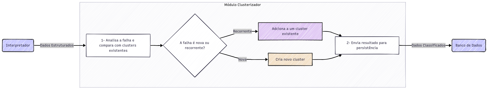
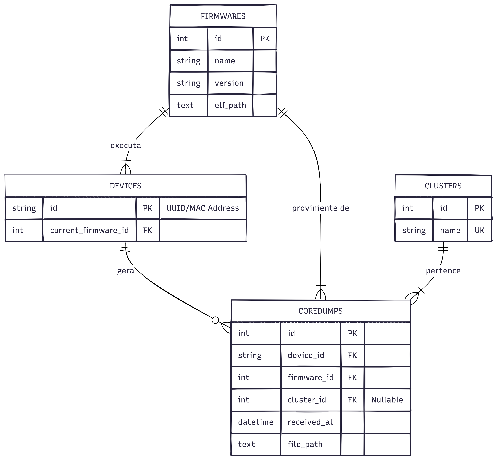
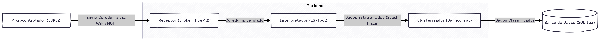

# CoreDump Extractor

Este é meu projeto de TCC para o curso de gradução em Engenharia de Computação na USP de São Carlos.


## CoreDump Uploader

O módulo `CoreDump Uploader` foi desenvolvido para facilitar a extração e o envio de relatórios de travamento (*coredumps*) de um dispositivo ESP32 para um servidor remoto. A principal vantagem desta abordagem é a sua flexibilidade. Em vez de acoplar o código a um protocolo de comunicação específico (como HTTP, MQTT ou TCP puro), o módulo utiliza um sistema de *callbacks*. Isso permite que o desenvolvedor implemente a lógica de comunicação que melhor se adapta ao seu projeto, seja ela qual for.

> **Nota sobre a Implementação:** O design deste módulo foi inspirado em duas implementações de referência. A primeira é o componente `coredump_upload` do **ESP-ADF (Espressif Advanced Development Framework)**, que valida a abordagem de extração e envio. No entanto, sua principal desvantagem é o forte acoplamento com o framework completo, tornando-o inviável para projetos que não utilizam seus outros recursos. A segunda inspiração é o projeto open-source **ESP32_coredump-to-server**, que introduziu um sistema de callbacks flexível, mas que se encontra abandonado desde 2022.
>
> Diante disso, a solução aqui apresentada foi criada para unir o melhor dos dois mundos: um componente moderno, enxuto e independente de frameworks pesados, mas que preserva a arquitetura flexível e agnóstica de protocolo baseada em callbacks.

O fluxo de operação é projetado para ser robusto e eficiente, especialmente em dispositivos com memória limitada. Ele lê o coredump diretamente da partição flash em blocos (*chunks*), opcionalmente codifica cada bloco em Base64 e o envia sequencialmente. Ao final do processo, se o envio for bem-sucedido, o coredump é apagado da flash para evitar reenvios desnecessários em reinicializações futuras.

### Arquitetura e Componentes

A arquitetura do módulo foi projetada para ser desacoplada, atuando como um orquestrador entre as APIs de baixo nível do sistema e a camada de comunicação da aplicação. O diagrama a seguir ilustra os componentes e suas interações.



* **Aplicação do Usuário / Camada de Comunicação:** É a parte do firmware responsável pela lógica de negócio e pela comunicação com a internet. É nesta camada que as funções de callback (`start`, `write`, `end`) são implementadas para definir *como* os dados serão transmitidos.
* **CoreDump Uploader (Este Módulo):** Atua como o cérebro da operação. Ele orquestra o processo: solicita a leitura dos dados à biblioteca do sistema, processa esses dados (divide em chunks, codifica) e os entrega à camada de aplicação através dos callbacks, delegando a responsabilidade da transmissão.
* **ESP-IDF Core Dump Library:** A biblioteca oficial da Espressif que fornece as APIs de baixo nível para interagir com a partição de coredump na flash (`esp_core_dump_image_get()`, etc.).
* **Memória Flash:** O componente de hardware onde o coredump fica fisicamente armazenado.
* **Backend:** O destino final para onde os dados do coredump são enviados para ser interpretado, clusterizado e por fim armazenado.

### Estruturas de Dados (Structs)

As estruturas de dados são usadas para configurar e informar o processo de upload.

#### ➤ `coredump_uploader_callbacks_t`

Esta é a estrutura central para a configuração do upload. Ela agrupa ponteiros para as funções que implementarão a comunicação. O usuário deve fornecer as implementações dessas funções.

```c
typedef struct {
    coredump_upload_start_cb_t start;
    coredump_upload_write_cb_t write;
    coredump_upload_end_cb_t end;
    coredump_upload_progress_cb_t progress;
    void *priv;
} coredump_uploader_callbacks_t;
```

  - `start`: Uma função opcional chamada uma única vez no início do processo. Ideal para inicializar conexões, enviar metadados (como o número total de *chunks*) ou autenticar com o servidor.
  - `write`: A única função **obrigatória**. É chamada para cada *chunk* de dados do coredump. Sua responsabilidade é enviar o bloco de dados para o destino remoto.
  - `end`: Uma função opcional chamada ao final do processo. Útil para fechar conexões, liberar recursos ou verificar uma resposta final do servidor.
  - `progress`: Um callback opcional invocado após o envio de cada *chunk*, permitindo monitorar o progresso do upload (ex: para atualizar uma barra de progresso ou detectar timeouts).
  - `priv`: Um ponteiro `void*` para dados de contexto do usuário. Permite passar qualquer tipo de dado (como um handle de conexão HTTP ou um objeto de cliente MQTT) para dentro dos callbacks, mantendo o estado entre as chamadas.

#### ➤ `coredump_uploader_info_t`

Esta estrutura contém todos os metadados sobre o coredump e seu particionamento. Ela pode ser pré-calculada e usada para informar o servidor sobre o upload que está prestes a começar.

```c
typedef struct coredump_uploader_info {
    size_t flash_addr;
    size_t total_size;
    size_t chunk_size;
    size_t chunk_count;
    size_t last_chunk_size;

    bool use_base64;

    // campos para tamanhos em Base64
    size_t b64_total_size;
    size_t b64_chunk_size;
    size_t b64_last_chunk_size;
} coredump_uploader_info_t;
```

  - `flash_addr`: O endereço de memória na flash onde o coredump se inicia.
  - `total_size`: O tamanho total, em bytes, do coredump.
  - `chunk_size`: O tamanho (em bytes) de cada *chunk* de dados, exceto possivelmente o último.
  - `chunk_count`: O número total de *chunks* em que o coredump será dividido.
  - `last_chunk_size`: O tamanho específico do último *chunk*.
  - `use_base64`: Um booleano que indica se a codificação Base64 está habilitada.
  - `b64_total_size`: O tamanho total do coredump após ser codificado em Base64.
  - `b64_chunk_size`: O tamanho (em bytes) de cada *chunk* de dados após a codificação em Base64, exceto possivelmente o último. 
  - `b64_last_chunk_size`: O tamanho específico do último *chunk* após a codificação em Base64.

##### Observação importante

**Por que não existe um `b64_chunk_count`?**
A estrutura não precisa de um contador de chunks separado para Base64 porque a quantidade de chunks é a mesma em ambos os cenários. O processo de upload divide o coredump binário em `N` pedaços primeiro. Em seguida, para cada pedaço, ele o codifica e envia. Isso cria uma relação de um para um: **1 chunk binário se transforma em 1 chunk codificado**. O que muda é o *tamanho* de cada chunk, não a *quantidade* total deles.

A codificação Base64 converte cada grupo de 3 bytes em 4 caracteres. Portanto, o cálculo dos tamanhos codificados geralmente segue a fórmula:

$$\text{Tamanho Base64} = 4 \times \left\lceil \frac{\text{Tamanho Original}}{3} \right\rceil$$

Esses campos de tamanho são úteis para:

  - Alocar buffers do tamanho correto para os dados codificados.
  - Informar ao servidor ou ao protocolo de comunicação o tamanho exato dos dados que serão enviados.
  - Evitar desperdício de memória ou erros de transmissão por causa de tamanhos incorretos.

### Funções Públicas

Estas são as funções que compõem a API pública do módulo.

#### ➤ `bool coredump_uploader_need_upload(void)`

Esta função deve ser chamada logo no início da aplicação para verificar se a última reinicialização foi causada por um erro que gera um coredump.

  - **Finalidade:** Determinar a necessidade de um upload.
  - **Funcionamento:** Ela analisa a razão do último reset do `esp_reset_reason()`. Retorna `true` para resets anormais como `ESP_RST_PANIC` ou `ESP_RST_TASK_WDT` (Watchdog Timer), e `false` para resets normais como `ESP_RST_POWERON`.
  - **Retorno:** `true` se um upload é recomendado, `false` caso contrário.

#### ➤ `esp_err_t coredump_uploader_get_info(coredump_uploader_info_t *out, size_t desired_chunk_size, bool use_base64)`

Use esta função para obter os metadados do coredump antes de iniciar o envio.

  - **Finalidade:** Preencher a estrutura `coredump_uploader_info_t` com informações sobre o coredump existente.
  - **Parâmetros:**
      - `out`: Um ponteiro para a estrutura `coredump_uploader_info_t` que será preenchida.
      - `desired_chunk_size`: O tamanho desejado para os *chunks*. Se for 0, um valor padrão (`768` bytes) é utilizado. Se a codificação Base64 for usada, este valor é ajustado para ser um múltiplo de 3 para otimizar a codificação.
      - `use_base64`: Define se os cálculos de tamanho devem considerar a futura codificação em Base64.
  - **Retorno:** `ESP_OK` se um coredump for encontrado, ou um código de erro caso contrário (ex: `ESP_ERR_NOT_FOUND`).

#### ➤ `esp_err_t coredump_upload(const coredump_uploader_callbacks_t *cbs, const coredump_uploader_info_t *info)`

Esta é a função principal que executa todo o processo de upload.

  - **Finalidade:** Ler o coredump da flash em *chunks* e enviá-lo usando os callbacks fornecidos.
  - **Funcionamento:**
    1.  Valida se o callback `write` foi fornecido.
    2.  Se a estrutura `info` não for passada, ela chama `coredump_uploader_get_info` internamente com configurações padrão.
    3.  Aloca buffers de memória para a leitura da flash e, se necessário, para a codificação Base64.
    4.  Chama o callback `start` (se existir).
    5.  Entra em um loop que, para cada *chunk*:
        a. Lê o bloco de dados da flash.
        b. Codifica-o em Base64 (se `use_base64` for `true`).
        c. Chama o callback `write` para enviar os dados.
        d. Chama o callback `progress` (se existir).
    6.  Ao final do loop, chama o callback `end` (se existir).
    7.  Se todo o processo ocorrer sem erros, chama `esp_core_dump_image_erase()` para apagar o coredump da flash. Caso contrário, o coredump é mantido para uma futura tentativa.
  - **Retorno:** `ESP_OK` se o envio e a limpeza forem bem-sucedidos, ou um código de erro indicando a falha.

---

## Backend

O backend constitui o núcleo de processamento do sistema, projetado para gerenciar o ciclo de vida completo de um coredump. Sua arquitetura foi concebida de forma modular para isolar as diferentes etapas do tratamento da falha, desde a coleta de dados brutos até a sua análise e classificação.

Esta estrutura é segmentada em três componentes lógicos principais, cada um com um escopo de responsabilidade bem definido dentro do fluxo de processamento:


- **Receptor:** Atua como a interface primária do sistema, responsável por estabelecer a comunicação com os dispositivos, receber os dados de falha e realizar uma validação inicial.
- **Interpretador:** Tem a função de traduzir os dados brutos do coredump em um formato estruturado e legível, extraindo as informações técnicas essenciais para o diagnóstico.
- **Clusterizador:** É o componente analítico, cuja responsabilidade é comparar as falhas interpretadas com uma base de conhecimento existente para agrupar erros recorrentes e identificar anomalias.

### Receptor

O Receptor atua como a porta de entrada (gateway) do backend. Seu objetivo principal é ser a interface de comunicação com os microcontroladores em campo, garantindo que os dados recebidos sejam autênticos e íntegros antes de iniciar o processamento.



**Requisitos Funcionais:**
- Expor um endpoint (por exemplo, uma API HTTP) seguro e estável para o recebimento dos coredumps.
- Ser capaz de processar requisições contendo dados binários (ou Base64) e metadados associados (como ID do dispositivo, versão do firmware, etc.).
- Rejeitar dados caso haja algum problema na envio/recepção.
- Encaminhar o coredump bruto para o módulo Interpretador.

### Interpretador

O **Interpretador** é o componente responsável por traduzir os dados brutos e de baixo nível de um *coredump* em um formato estruturado e legível por humanos. O objetivo é extrair as informações essenciais para a análise da falha.



**Requisitos Funcionais:**
* Acessar o arquivo binário do *coredump* encaminhado pelo Receptor.
* Utilizar os arquivos de depuração (*debugging symbols*), correspondentes à versão do firmware, para mapear os endereços de memória a nomes de funções e linhas de código.
* Estruturar as informações extraídas em um formato padronizado (como JSON), facilitando o processamento pelo módulo seguinte.
* Encaminhar as informações extraídas, e padronizadas, para o módulo Clusterizador.

### Clusterizador

O **Clusterizador** é o cérebro analítico do sistema. Sua função é analisar os dados interpretados do *coredump* e agrupá-lo com outras falhas semelhantes, permitindo a deduplicação de erros e a identificação da frequência de cada problema.



**Requisitos Funcionais:**
* Receber e processar os dados estruturados do Interpretador.
* Calcular a similaridade entre o novo coredump e os clusters já existentes.
* Atribuir o coredump a um cluster existente ou criar um novo cluster para a falha.
* Salvar a associação do coredump ao seu respectivo cluster no banco de dados.

---

## Banco de Dados

Para um banco de dados mínimo e funcional para nosso sistema de extração remota e classificação de coredups os re
Este documento define a estrutura de dados mínima e essencial para o sistema de extração remota e classificação de coredumps. O objetivo é estabelecer um esquema de banco de dados que suporte o armazenamento de firmwares, dispositivos, coredumps e os clusters de classificação resultantes, garantindo a rastreabilidade e a integridade das informações.

### Diagrama Entidade-Relacionamento (ER)

Para visualizar as relações, podemos imaginar o seguinte diagrama:



*Legenda: `PK` - Chave Primária, `FK` - Chave Estrangeira, `UK` - Chave Única.*, `||` - Exatamente um, `o{` - Zero ou mais, `|{` - Um ou mais.

### Descrição das Entidades

#### FIRMWARES

Esta entidade funciona como um catálogo de todas as versões de software existentes. Armazenar o **nome** e a **versão** de cada firmware é fundamental para saber exatamente qual código estava em execução quando uma falha ocorreu.

#### DEVICES

Representa cada dispositivo físico (hardware) monitorado pelo sistema. O seu identificador único (`id`, como um MAC Address) é a chave para rastrear a origem de um coredump. O relacionamento com `FIRMWARES` permite saber qual software está ativo em cada dispositivo em tempo real.

#### CLUSTERS

É a entidade central para a funcionalidade de **classificação**. Cada registro em `CLUSTERS` representa um "tipo" de erro ou falha única. Ao agrupar coredumps semelhantes sob o mesmo cluster, o sistema permite identificar a frequência e o impacto de cada bug específico. O `name` do cluster serve como um identificador legível para a falha (ex: "STACK\_OVERFLOW\_WIFI\_TASK").

#### COREDUMPS

Esta é a entidade principal, registrando cada evento de falha individual. Cada coredump está obrigatoriamente ligado ao **dispositivo** que o gerou e ao **firmware** que estava executando no momento da falha. O campo `cluster_id` é `Nullable` (pode ser nulo) porque um coredump é primeiro recebido e só depois classificado. O `file_path` aponta para o local do arquivo de coredump (já interpretado), evitando sobrecarregar o banco de dados.

### Justificativa dos Relacionamentos

Os relacionamentos definem as regras de negócio e garantem a integridade dos dados.

#### `FIRMWARES ||--|{ DEVICES : "executa em"`

  * **Leitura:** Um `FIRMWARE` é executado em um ou mais `DEVICES`.
  * **Justificativa (1:N):** Este relacionamento de "um para muitos" modela a realidade da implantação de software em IoT. Uma única versão de firmware (ex: `v2.1.0`) é distribuída e executada em centenas ou milhares de dispositivos físicos.

#### `DEVICES ||--o{ COREDUMPS : "gera"`

  * **Leitura:** Um `DEVICE` gera zero ou mais `COREDUMPS`.
  * **Justificativa (1:N):** Ao longo de sua vida útil, um dispositivo pode falhar várias vezes. Este relacionamento permite manter um histórico completo de todas as falhas ocorridas em um hardware específico, o que é útil para identificar problemas crônicos de hardware ou de uso.

#### `FIRMWARES ||--o{ COREDUMPS : "proveniente de"`

  * **Leitura:** Um `FIRMWARE` é a origem de zero ou mais `COREDUMPS`.
  * **Justificativa (1:N):** Essencial para a análise de software e interpretação do **coredump**. Este link direto permite agregar todas as falhas relacionadas a uma versão específica do firmware, respondendo a perguntas como: "A versão `v2.1.0` é mais ou menos estável que a `v2.0.0`?".

#### `CLUSTERS ||--|{ COREDUMPS : "pertence a"`

  * **Leitura:** Um `CLUSTER` agrupa um ou mais `COREDUMPS`.
  * **Justificativa (1:N):** Este é o relacionamento que materializa a classificação. Um tipo de erro específico (o Cluster) pode acontecer repetidamente em diferentes dispositivos e versões de firmware. Agrupar todos esses eventos de **coredump** sob um único cluster permite quantificar a frequência e priorizar a correção dos bugs mais impactantes.

### Fluxo de Dados

1.  **Registro de Firmware/Dispositivo:** Um novo `FIRMWARE` é cadastrado. Um `DEVICE` é registrado e associado a uma versão de firmware.
2.  **Recebimento do Coredump:**
      * Um dispositivo envia um coredump.
      * O sistema cria uma nova entrada na tabela `COREDUMPS`.
      * Ele preenche o `device_id` e o `firmware_id` com base nas informações do dispositivo que enviou.
      * O campo `cluster_id` é deixado como `NULL`.
      * O arquivo do coredump e o *ELF* do `FIRMWARE` gerador, são utilizados para interpretação 
      * O coredump interpretado é salvo em disco e o caminho é armazenado em `file_path`.
3.  **Classificação:**
      * Um processo analisa o coredump recém-chegado.
      * Se ele corresponde a uma falha já conhecida, seu `cluster_id` é atualizado para o ID do `CLUSTER` existente.
      * Se for uma falha nova, um novo registro é criado em `CLUSTERS` e o `cluster_id` do coredump é atualizado com o ID do novo cluster.

---

## Visualização dos Dados (GUI)

???

--- 

## Arquitetura do Protótipo

O protótipo foi desenvolvido utilizando os seguintes componentes e tecnologias, com todos os scripts do back-end implementados em **Python 3:**



* **Microcontrolador e Firmware:** O firmware do dispositivo foi desenvolvido para o microcontrolador **ESP32** utilizando o framework **ESP-IDF v5.5.1**.

* **Protocolo de Conectividade:** O ESP32 oferece múltiplos protocolos de conectividade nativos (Bluetooth, Wi-Fi e Ethernet). Dentre eles, o **Wi-Fi** foi selecionado por facilitar o acesso à internet e a comunicação com o servidor.

* **Protocolo de Comunicação:** A comunicação entre o dispositivo e o servidor é feita via **MQTT**, um protocolo de mensageria leve e eficiente. Para a fase de prototipagem, foi utilizado o broker gratuito da **HiveMQ**.

* **Banco de Dados:** Para o armazenamento de metadados, foi selecionado o **SQLite3** devido à sua simplicidade e fácil integração com Python, operando sem a necessidade de um servidor dedicado.

* **Análise e Clusterização:** O agrupamento e a análise dos *coredumps* são realizados com a biblioteca `Damicorepy`, uma implementação da metodologia **DAMICORE**.

* **Armazenamento dos Coredumps:** Os arquivos de *coredump* são mantidos em uma estrutura de diretórios no sistema de arquivos. Essa abordagem foi escolhida para evitar o armazenamento de dados binários grandes (`BLOBs`) no SQLite3, prevenindo problemas de performance e sobrecarga do banco.

### ESP32

A escolha do ESP32 para a Prova de Conceito (PoC) se baseia em três fatores principais:

* **Relevância de Mercado:** É um dos microcontroladores com Wi-Fi mais utilizados no mundo, fabricado pela líder de mercado Espressif, tornando a solução aplicável a um vasto ecossistema de dispositivos.
* **Custo-Benefício e Recursos:** Integra conectividade Wi-Fi e Bluetooth a um baixo custo, sendo uma plataforma ideal para projetos de IoT.
* **Ecossistema Robusto:** Possui vasta documentação, uma grande comunidade de desenvolvedores e ferramentas maduras como o ESP-IDF, que agilizam o desenvolvimento.

Apesar de a implementação prática usar o ESP32, a arquitetura da solução é agnóstica ao hardware, e toda a metodologia pode ser portada para outros microcontroladores.

#### Hardware

O projeto utiliza a placa de desenvolvimento ESP32-DevKitC V4, equipada com o módulo ESP32-WROOM-32U. Embora este módulo seja classificado pela Espressif como "Não Recomendado para Novos Projetos (NRND)" devido à existência de chips mais modernos, sua escolha para este TCC foi justificada por dois fatores principais:

* **Disponibilidade:** Foi o hardware acessível para a realização do trabalho.

* **Suficiência Técnica:** Seus recursos de processamento e conectividade Wi-Fi atendem plenamente a todos os requisitos do projeto.

#### Framework

O firmware foi desenvolvido com o ESP-IDF v5.5.1, o framework oficial da Espressif. Ele foi escolhido em vez de plataformas mais abstratas, como o Arduino Core, pela necessidade de controle de baixo nível sobre os recursos do hardware, incluindo o sistema operacional de tempo real (FreeRTOS) e as pilhas de comunicação otimizadas.

A versão v5.5.1 foi selecionada por estar, na época do desenvolvimento, em seu "Período de Serviço" conforme a política de suporte da Espressif. Esta é a fase em que o fabricante recomenda o uso para novos projetos, garantindo uma plataforma estável, com suporte ativo a correções críticas e sem alterações que quebrem a compatibilidade.

### MQTT

A Prova de Conceito utiliza MQTT sobre uma rede Wi-Fi. As escolhas foram baseadas nos seguintes motivos:

* **Wi-Fi:** Selecionado pela conveniência de usar a infraestrutura de rede local já existente no ambiente de desenvolvimento e pela compatibilidade nativa com o ESP32.
* **MQTT:** Adotado por ser um padrão de fato em aplicações IoT, oferecendo vantagens cruciais:
  - **Leveza:** Baixo consumo de banda e recursos, ideal para microcontroladores.
  - **Modelo Publish/Subscribe:** Permite criar uma arquitetura de software desacoplada e facilmente escalável.
  - **Ecossistema Maduro:** Grande disponibilidade de bibliotecas e suporte da comunidade, o que acelera o desenvolvimento.

#### Funcionamento do MQTT no Contexto de Coredumps

No nosso sistema, o MQTT funciona com base em três componentes principais:

  * **Publisher (Publicador):** A **ESP32**, que envia o coredump após uma falha.
  * **Subscriber (Assinante):** O **Receptor**, o serviço responsável por coletar, armazenar e processar os coredumps.
  * **Broker (Servidor):** O servidor central que gerencia e distribui as mensagens.


O fluxo, como demonstrado no diagrama acima, ocorre em três passos simples:

1.  **Assinatura (Subscribe):** O **Receptor** (Subscriber) se conecta ao Broker e se inscreve no tópico `coredump/#`. O caractere `#` é um coringa (*wildcard*) que indica o interesse em receber todas as mensagens de tópicos que comecem com `coredump/`, independentemente do ID do dispositivo.

2.  **Publicação (Publish):** Quando uma falha ocorre, a **ESP32** (Publisher) envia os dados do coredump para um tópico específico que a identifica, como `coredump/ESP-341A`, entregando a mensagem ao Broker. A ESP32 não precisa saber onde o Receptor está ou quem ele é.

3.  **Distribuição:** O Broker recebe o coredump, verifica que o tópico `coredump/ESP-341A` corresponde à assinatura `coredump/#` do Receptor, e então encaminha a mensagem diretamente para ele.

A principal vantagem é que o **Broker desacopla** os componentes: a ESP32 em campo não precisa conhecer o endereço ou a implementação do Receptor, e vice-versa. Isso torna o sistema de extração de coredumps muito mais flexível e escalável, permitindo adicionar novos dispositivos ou novas instâncias do Receptor sem reconfigurar todo o sistema.

#### Broker HiveMQ

Para a implementação de referência, foi utilizado o broker público e gratuito da HiveMQ. A escolha desta solução se deu por ser uma plataforma robusta, confiável e amplamente utilizada no mercado, o que simplificou a configuração do ambiente e acelerou o desenvolvimento do protótipo.

### Subscriber

### CoreDump Interpreter

### CoreDump Clusterizer

### Cluster Sincronyzer

### DB Manager
