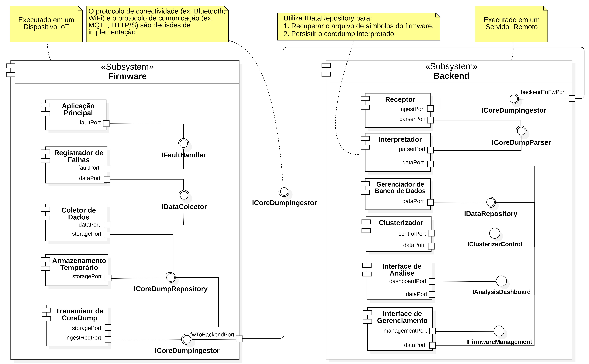
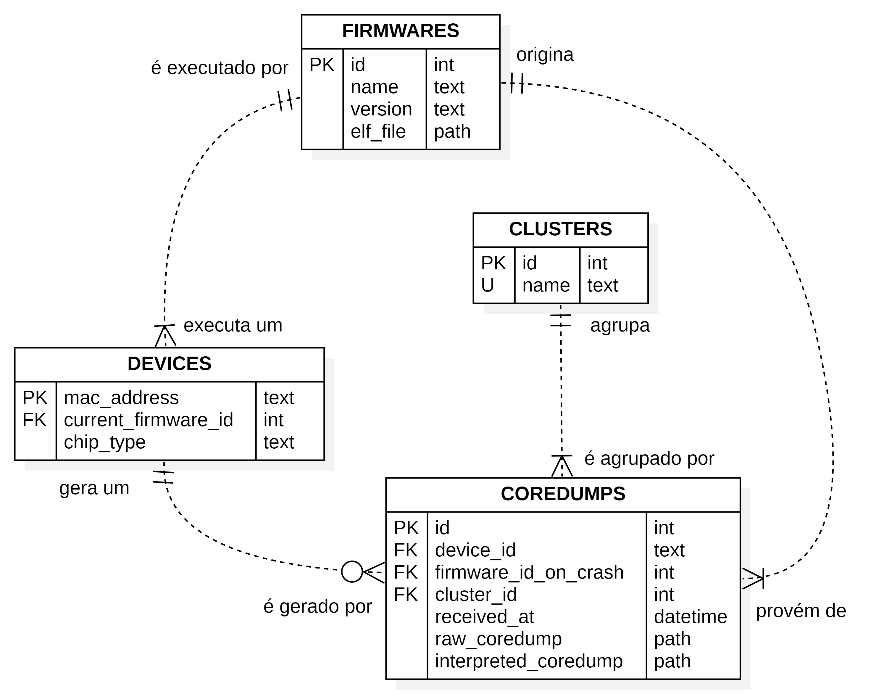

# CoreDump Extractor

Sistema completo para recepção, análise e agrupamento de coredumps de dispositivos ESP32 via MQTT. O projeto inclui uma interface gráfica para gerenciamento de firmwares e dispositivos, dashboard simples de análise e um backend que processa coredumps automaticamente.



## 📋 Requisitos

- Python 3.9+
- Docker e Docker Compose
- ESP-IDF (para compilar o firmware ESP32)

## 🚀 Setup Inicial

### 1. Criar e Ativar Ambiente Virtual

```bash
# Criar ambiente virtual
python -m venv .venv

# Ativar ambiente virtual
# Windows (PowerShell):
.venv\Scripts\Activate.ps1

# Windows (CMD):
.venv\Scripts\activate.bat

# Linux/Mac:
source .venv/bin/activate
```

### 2. Instalar Dependências

```bash
pip install -r requirements.txt
```

### 3. Configurar Variáveis de Ambiente

Copie o arquivo de exemplo e configure suas credenciais:

```bash
cp .env.example .env
```

Edite o arquivo `.env` e preencha com suas credenciais MQTT:

```env
MQTT_HOST="seu-broker-mqtt.com"
MQTT_PORT=8883
MQTT_USER="seu-usuario-mqtt"
MQTT_PASS="sua-senha-mqtt"
```

### 4. Iniciar Containers Docker

O projeto utiliza containers Docker para processamento de coredumps. Inicie os containers:

```bash
cd backend
docker-compose up -d
```

Os containers disponibilizam:
- **esp-idf**: Ambiente ESP-IDF para processamento de coredumps
- **damicore-app**: Aplicação para clusterização de coredumps

## ⚙️ Configuração

### Arquivo .env

O arquivo `.env` contém todas as configurações necessárias para o sistema:

**Variáveis Obrigatórias:**
- `MQTT_HOST`: Endereço do broker MQTT
- `MQTT_PORT`: Porta do broker MQTT (geralmente 8883 para MQTT over TLS)
- `MQTT_USER`: Usuário para autenticação MQTT
- `MQTT_PASS`: Senha para autenticação MQTT

**Variáveis Opcionais:**
- `MQTT_BASE_TOPIC`: Tópico base para coredumps (padrão: `coredump`)
- `DEVICE_READY_TOPIC`: Tópico para sinalização de dispositivo pronto (padrão: `device/ready`)
- `DEVICE_FAULT_INJECTION_TOPIC`: Tópico para injeção de falhas (padrão: `device/fault_injection`)
- `COREDUMP_TIMEOUT_SECONDS`: Timeout para sessões de coredump (padrão: `600`)
- `COREDUMP_RAWS_OUTPUT_DIR`: Diretório para coredumps brutos (padrão: `db/coredumps/raws`)
- `COREDUMP_REPORTS_OUTPUT_DIR`: Diretório para relatórios (padrão: `db/coredumps/reports`)
- `COREDUMP_ACCEPT_BASE64`: Aceitar coredumps em Base64 (padrão: `1`)

## 🖥️ Execução da GUI

Execute a interface gráfica para gerenciar firmwares, dispositivos e visualizar análises:

```bash
python -m GUI.main
```

### Gerenciamento de Banco de Dados

Na GUI, acesse a seção **"Gerenciamento de Banco de Dados"** para:

1. **Cadastrar Firmware:**
   - Selecione a tabela "Firmwares"
   - Pressione `A` para adicionar
   - Preencha: Nome, Versão e caminho do arquivo `.elf`

2. **Cadastrar Dispositivo:**
   - Selecione a tabela "Devices"
   - Pressione `A` para adicionar
   - Preencha: MAC Address, Firmware ID e tipo de chip (ESP32/ESP32-S2/etc)

3. **Visualizar Coredumps:**
   - Navegue pela tabela "Coredumps" para ver todos os coredumps recebidos
   - Visualize relatórios e logs gerados

### Dashboard de Análise

Acesse o **Dashboard** para visualizar:
- Estatísticas de coredumps por firmware
- Gráficos de falhas
- Análise de clusters
- Métricas de dispositivos

## 🔧 Execução do Backend

O backend recebe coredumps via MQTT, processa e agrupa automaticamente:

```bash
python -m backend.wiring
```

O backend:
- Conecta ao broker MQTT configurado
- Recebe coredumps enviados pelos dispositivos ESP32
- Processa cada coredump usando o container Docker
- Gera relatórios de análise
- Agrupa coredumps similares em clusters
- Armazena tudo no banco de dados SQLite

**Nota:** O backend deve estar rodando enquanto os dispositivos ESP32 estão enviando coredumps.

## 📱 Projeto ESP32

O firmware ESP32 está localizado no diretório `main/`. Para compilar e configurar:

### Configuração via Menuconfig

As credenciais MQTT e WiFi devem ser configuradas usando o menuconfig do ESP-IDF:

```bash
idf.py menuconfig
```

Navegue até **"Connectivity Settings"** e configure:

- **Wi-Fi Network SSID**: Nome da rede WiFi
- **Wi-Fi Network Password**: Senha da rede WiFi
- **MQTT Broker URI**: URI completa do broker (ex: `mqtts://broker.example.com:8883`)
- **MQTT Username**: Usuário MQTT
- **MQTT Password**: Senha MQTT

**Importante:** Nunca commite o arquivo `sdkconfig` com credenciais reais. Use o arquivo `myconfigs` localmente ou configure apenas via menuconfig.

### Compilação e Flash

```bash
idf.py build
idf.py flash monitor
```

## 🧪 Script de Injeção de Falhas

O script `scripts/fault_injection_trigger.py` permite testar o sistema injetando falhas controladas em dispositivos ESP32:

```bash
python scripts/fault_injection_trigger.py
```

O script:
1. Conecta ao broker MQTT
2. Aguarda o dispositivo ficar pronto (sinal via tópico `device/ready`)
3. Injeta falhas sequenciais de diferentes tipos:
   - `IllegalInstructionCause`
   - `LoadProhibited`
   - `StoreProhibited`
   - `IntegerDivideByZero`
   - `Stack Overflow`
4. Aguarda o dispositivo se recuperar antes de injetar a próxima falha
5. Repete o processo conforme solicitado

**Uso:**
- Execute o script quando o dispositivo ESP32 estiver rodando
- Informe quantas iterações deseja executar
- O script gera uma ordem aleatória de falhas a cada iteração
- Cada falha causa um coredump que será recebido e processado pelo backend

## 📁 Estrutura do Projeto

```
.
├── backend/              # Backend Python
│   ├── components/      # Componentes principais
│   ├── docker-compose.yml
│   └── wiring.py        # Ponto de entrada do backend
├── GUI/                 # Interface gráfica TUI
│   ├── main.py          # Ponto de entrada da GUI
│   ├── manager.py       # Gerenciamento de banco de dados
│   └── dashboard.py     # Dashboard de análise
├── main/                # Firmware ESP32
│   ├── connection/      # Módulos de conexão (WiFi, MQTT)
│   ├── coredump_uploader/  # Módulo de upload de coredump
│   └── faults/         # Módulo de injeção de falhas
├── scripts/             # Scripts auxiliares
│   └── fault_injection_trigger.py
├── db/                  # Banco de dados e arquivos gerados
└── .env.example         # Template de configuração
```

## Banco de dados



## 📝 Licença

Projeto de TCC - Engenharia de Computação - USP São Carlos

